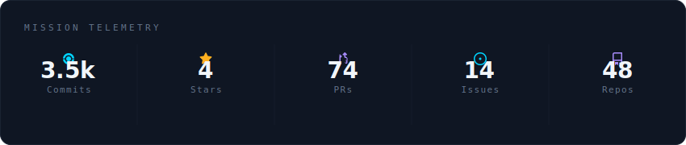

<div align="center">

<!-- Galaxy Header — auto-generated spiral galaxy banner -->


<!-- Mission Telemetry — GitHub stats -->


<!-- Language Telemetry + Focus Sectors -->


<!-- Featured Systems — project constellation -->


</div>

----

#### About Me

```typescript
const Gabriel = {
  age: "23 years",
  work: "Backend Developer intern at Tucupy Tecnologia",
  studying: ["Terraform", "AWS", "Docker", "GitHub Actions", "Redis"],
  education: "Majoring in Computer Science at CESUPA",
  mainLanguages: ["TypeScript", "Golang", "Java"],
  databases: ["PostgreSQL", "Redis", "MongoDB"],
  architectures: ["microservices", "clean architecture", "Domain-Driven Design"],
  hobbies: ["movies", "video games", "CS player", "Metal Gear fan"],
};
```

----

#### Contact Me

[](https://www.linkedin.com/in/gabriel-mattos-teixeira-dos-santos-53b469297/)
[](mailto:gabrielmatsan@hotmail.com)

---

<sub>Profile visuals auto-generated by <a href="https://github.com/vinimlo/galaxy-profile">Galaxy Profile</a></sub>
